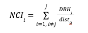

Here you can find the clean data that we used for our analysis. This data are an export of ```scripts/PREMON_data_prep.r``` script.

LFDP environmental data have spatial information according to the location of each individual stem within the 16-ha plot.

## Metadata
<p> For each of these palms, we measured stem height from the ground to the base of the crown (H<sub>bc</sub>; height of the youngest internode), diameter at 130 cm above ground (D<sub>130</sub>), and basal diameter (D<sub>B</sub>; just above the top of the roots) (Figure S1). For palms with H<sub>bc</sub> ≤ 2 m, we measured height with a measuring tape, for palms between 2 and 5 m tall, we used a calibrated extension pole, and for palms > 5 m, we used a Nikon forestry Pro II rangefinder. ```Second coordinate``` was used to associate palms of unknown tag with environmental heterogeneity dataset.</p>

- ```Tag``` = Unique tag number for the individual stem. Tag number is the relational variable which we can match with historic data of LDFP.

- ```basal_d``` = diameter at base of stem (cm)

- ```dbh``` = diameter at breast height (cm) 

- ```height``` = stem height (m)

- ```h_dbh``` = height at which dbh was measured (m)

- ```notes```= notes taken in the field

- ```second coord``` = second cordinate; some palms either had missing tags or were located outside the boundaries of LFDP. In case an individual was close to a known (taged) palm, then the unique tag number of the closest in proximity palm is stored here.

- ```quadrat``` = Using as a relational variable the unique stem ```Tag```, we associated our measured palms with LFDP census data. Quadrat refer to the location of our measured palm within the 16-ha plot of LFDP.

- ```Elev``` = Elevation; Using as a relational variable the ```quadrat``` we associated our measured palms with environmental attributes of LFDP.

- ```Slope``` = Slope; Using as a relational variable the ```quadrat``` we associated our measured palms with environmental attributes of LFDP.

- ```SR``` = Slenderness Ration (SR) is the ratio of height to diameter at breast height (H<sub>bc</sub>/D<sub>130</sub>).

- ```nci``` = Neighborhood Crowding Index. We computed a neighborhood crowding index (NCI) based on the density and size of trees in a 20 m radius surrounding each focal palm, following Uriarte *et al*. (2004). Specifically, NCI was computed as the sum of the ratio of DBH of each j neighboring tree divided by its distance from the focal tree i:

<div align="center">



</div>

<blockquote>
  <p>where dist<sub>ij</sub> is the distance between the focal tree i and the neighboring tree j, and DBH<sub>j</sub> is the diameter at breast height of the neighboring tree j. We used the NCI as a measure of competition for light.</p>
</blockquote>
